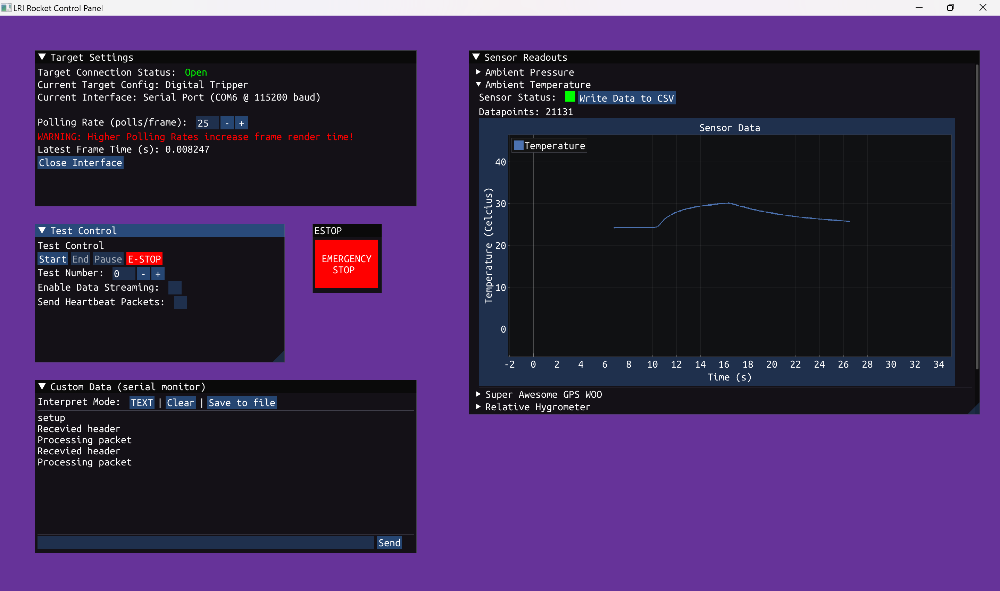
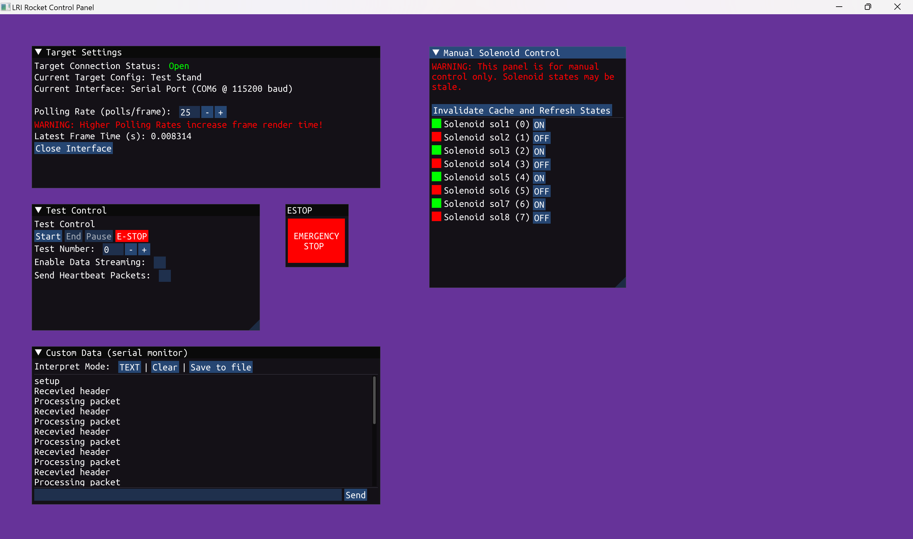

# LRI Rocket Control Interface

## Introduction

The LRI Rocket Control Interface (RCI) is a graphical program for interacting with and controlling test targets (see
[RCP](https://github.com/liquid-rocketry-illinois/RCP-Host))
built by members of the Liquid Rocketry at Illinois RSO. It provides a simple UI for viewing sensor outputs, manual
control of actuators, and running automated tests.

RCI currently _only_ supports Windows targets, however the program is portable and does not require any addition
installation beyond downloading the executable. Prebuilt binaries can be downloaded from this Github page under the
releases section (`LRIRCI.exe`), or a full environment that also contains the target configuration files (`env.zip`).

_Example showing some graphed data_

_Example showing the solenoid control window_
## Usage

After downloading and running the executable, select the desired target configuration and interface from the
dropdowns in the `Target Settings` window. On a successful interface creation, the UI will automatically be
populated with controls for the actuators and sensors defined in the target configuration.

All sensors will be accessible in the `Sensor Readings` window, with values graphed as they are received. Sensor data
can be saved to a CSV file (in the working directory, under `exports/`). Actuators will each have their own windows with
their respective controls. An emergency stop, a test window, and a raw data console will be present for all targets
regardless of their configuration.

## Compiling

RCI is written in C++ 23, and requires all libraries submoduled in `libs/` to be cloned in order to build. No other
libraries or environment is necessary, besides a recent enough version of CMake. RCI is intended to be built with
MSVC, as the CMake file specifies the MSVC specific static linking options to statically link the c++ standard
library to ensure the program's portability. No other libraries or environments are needed to build.

### Other Development Files

Inside `testbench/testbench.ino` is a simple arduino sketch for testing various components. It tests the stepper
motor and solenoid controls, as well as the ambient temperature sensor (its really just for me). In addition, one of
the interfaces available in the target settings is the `Virtual Port`. This interface only contains stubs for the
various functions used by [RCP](https://github.com/liquid-rocketry-illinois/RCP-Host), and is used so that the UI
can be populated without having a target to test with. This interface is not intended to be used for regular usage,
and will soon be moved to be built only for debug targets.

In addition, a short Github release automation script is present in `GithubRelease.sh`. This is not intended to be
used by anyone but the maintainer (Jacob Baumel), and was only created because he was tired of manually uploading
releases. It is not intended to be run manually, but rather as a part of CMake, where it is defined as a CMake
target in order to ensure builds are prepared before it's execution. It requires both a bash environment (i.e. MSYS,
Git for Windows, etc.) and Github CLI to be installed in order to use. It will tag the latest commit with the
entered version number, create env.zip, prompt for release notes, and upload everything (release notes, binaries
including `LRIRCI.exe` and `env.zip`) as a new release. Again, not intended for other people.

## TODO list

Although the program is in a mostly complete state, there are a few things left to work on:

- [x] Readmes for the other related projects ([Test Stand](https://github.com/liquid-rocketry-illinois/test-stand-sw),
  [RCP](https://github.com/liquid-rocketry-illinois/RCP-Host))
- [ ] Proper DPI scaling (right now everything only looks nice on 2880x1800)
- [ ] Switch out glfw for sfml (dpi makes me sad)
- [x] Full screen graphs and better scaling for non-fullscreen graphs
- [ ] Test mode lockout of actuators
- [ ] Better error and heartbeat handling
- [ ] Some final fixes to RCP
- [ ] Fix whatever is going on with the button delay
- [ ] Linux support
- [ ] Nicer UI styling and executable icon
- [ ] Fancy emergency stop button :)
