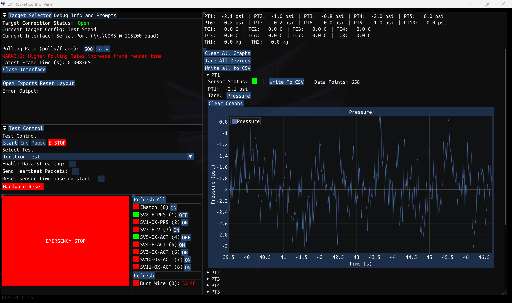
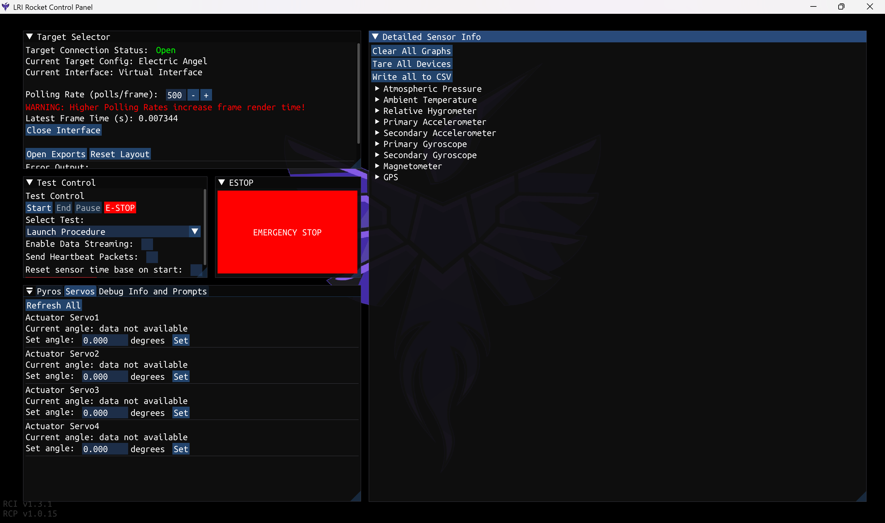

# LRI Rocket Control Interface

## Introduction

The LRI Rocket Control Interface (RCI) is a graphical program for interacting with and controlling test targets (see
[RCP](https://github.com/liquid-rocketry-illinois/RCP-Host))
built by members of the Liquid Rocketry at Illinois RSO. It provides a simple UI for viewing sensor outputs, manual
control of actuators, and running automated tests.

RCI currently _only_ supports Windows targets. To install, go to the releases section on the right side of this page,
and download/install the `.msi` file in the assets section.

## Usage

After downloading and installing, select the desired target configuration and interface from the
dropdowns in the `Target Settings` window. On a successful interface creation, the UI will automatically be
populated with controls for the actuators and sensors defined in the target configuration.

All sensors will be accessible in the `Sensor Readings` window, with values graphed as they are received. Sensor data
can be saved to a CSV file (in the working directory, under `exports/`). Actuators will each have their own windows with
their respective controls. An emergency stop, a test window, and a raw data console will be present for all targets
regardless of their configuration.

## Compiling

RCI is written in C++ 23, and requires all libraries submoduled in `libs/` to be cloned in order to build. No other
libraries or environment is necessary, besides a recent enough version of CMake. RCI is intended to be built with
MSVC.

### Other Development Files

For an example RCP target implementation, see the
[Target Library](https://github.com/liquid-rocketry-illinois/RCP-Target). For the RCP specification, see
the [Host Library](https://github.com/liquid-rocketry-illinois/RCP-Host/). For more implementation examples, see the 
[RANDE Implementation](https://github.com/liquid-rocketry-illinois/RCP-Host/).

The virtual port in the target settings can also be used to load the UI without actually connecting to a target.

In addition, a short Github release automation script is present in `GithubRelease.sh`. This is not intended to be
used by anyone but the maintainer (Jacob Baumel), and was only created because he was tired of manually uploading
releases. It is not intended to be run manually, but rather as a part of CMake, where it is defined as a CMake
target in order to ensure builds are prepared before it's execution. It requires both a bash environment (i.e. MSYS,
Git for Windows, etc.) and Github CLI to be installed in order to use. It will tag the latest commit with the
entered version number, create the release assets, prompt for release notes, and upload everything (release notes,
binaries including `LRIRCI.exe` and the installer MSI) as a new release. Again, not intended for other people.
